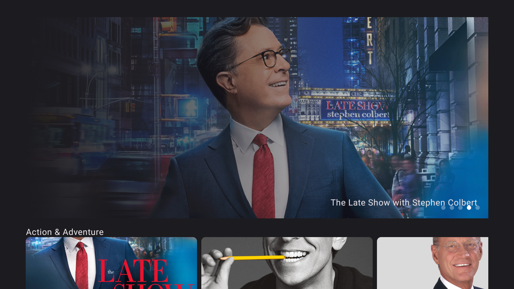
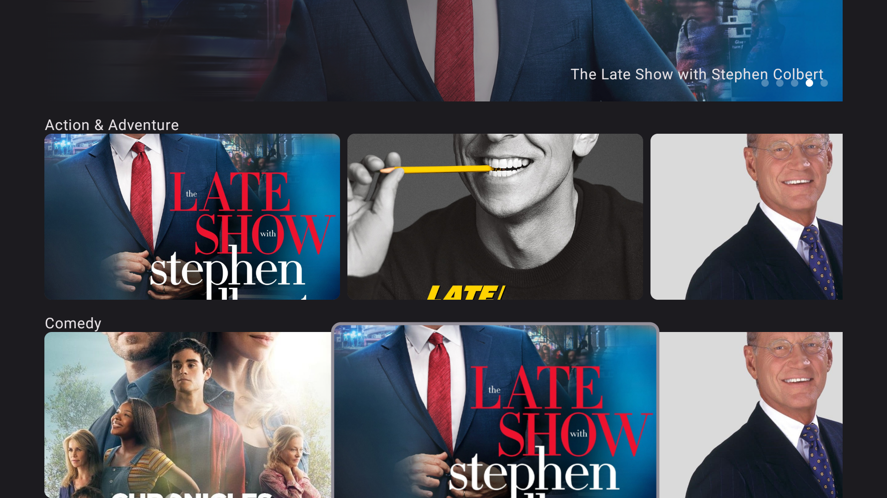

# Android TV Application

This Android TV application allows users to browse popular movies through a carousel and explore different movie categories. The app provides a seamless viewing experience optimized for Android TV.

## Features

- **Movie Carousel**: Display a carousel of popular movies on the home screen.
- **Movie Categories**: Browse through different categories of movies.
- **Optimized for TV**: UI optimized for Android TV's larger screen size and remote controls.

## Tech Stack

- **Language**: Kotlin
- **Architecture**: MVVM (Model-View-ViewModel)
- **Image Loading**: Coil for loading movie posters and images
- **UI**: Jetpack Compose for TV layout

## Screenshots

### Home Screen with Carousel of Popular Movies


### Categories List with Movies


## Getting Started

### Prerequisites

- Android Studio Arctic Fox or above
- Android TV device or emulator
- API key from The Movie Database (TMDb)

### Installation

1. Clone the repository:
    ```bash
    git clone https://github.com/Rahul-Dey12/TV-Application.git
    ```
2. Open the project in Android Studio.
3. Build and run the application on an Android TV device or emulator.
